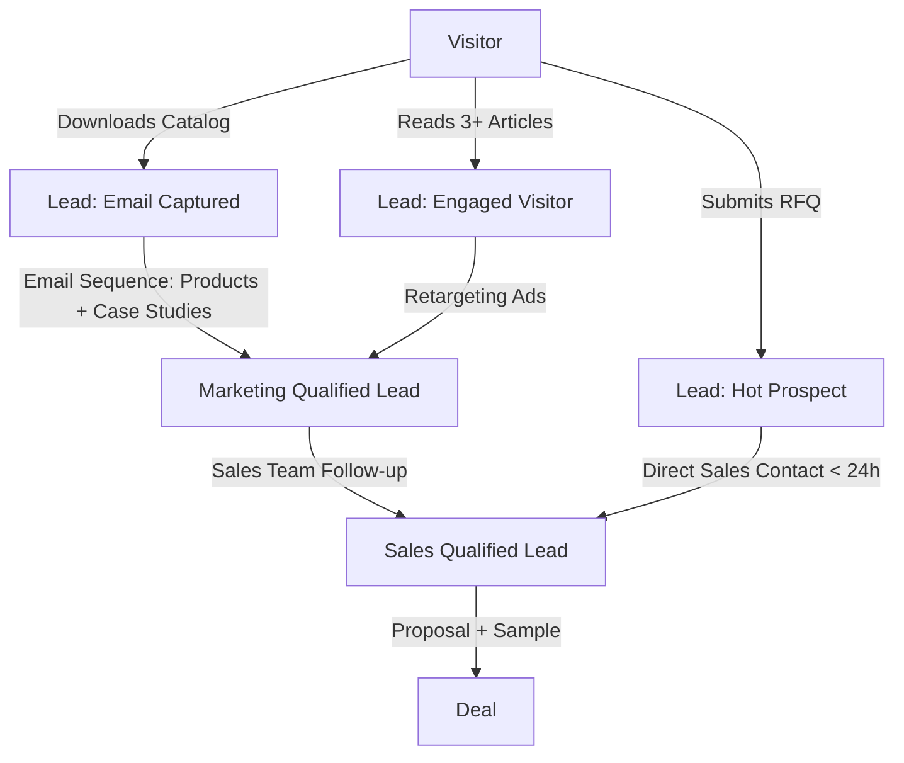
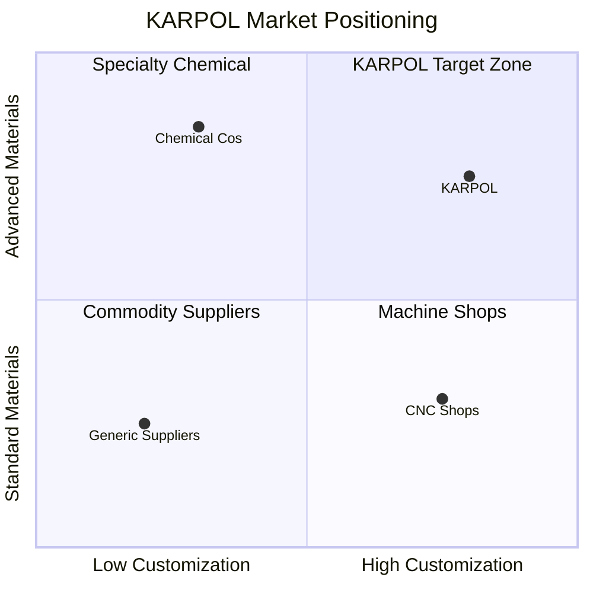
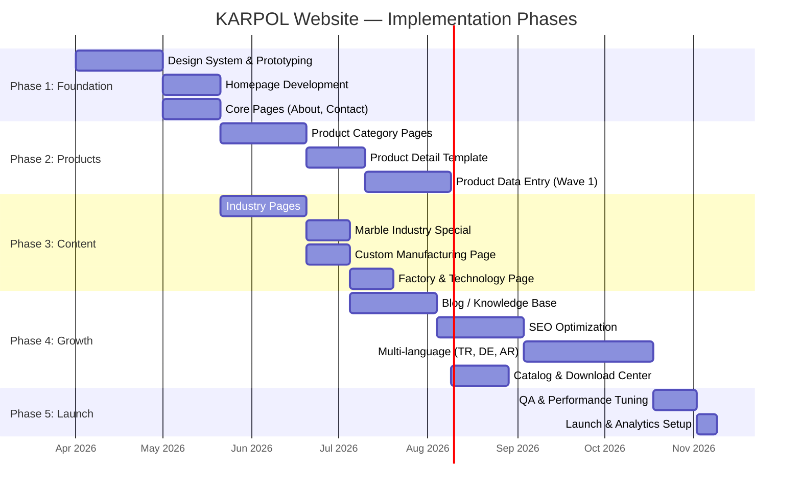

# KARPOL — Digital Product Strategy
### Global Industrial Manufacturing Website

> **Objective:** Position KARPOL as a world-class European industrial engineering brand through a premium digital presence that communicates authority, precision, and global capability.

---

## 1. Website Architecture

```mermaid
graph TD
    HOME[🏠 Home] --> ABOUT[About KARPOL]
    HOME --> PRODUCTS[Products]
    HOME --> INDUSTRIES[Industries]
    HOME --> CUSTOM[Custom Manufacturing]
    HOME --> FACTORY[Factory & Technology]
    HOME --> KNOWLEDGE[Technical Knowledge]
    HOME --> CATALOG[Catalog & Downloads]
    HOME --> CONTACT[Contact / RFQ]

    ABOUT --> HISTORY[Company History]
    ABOUT --> MISSION[Mission & Values]
    ABOUT --> CERTS[Certifications & Quality]
    ABOUT --> TEAM[Leadership]
    ABOUT --> GLOBAL[Global Reach]

    PRODUCTS --> PU[Polyurethane Products]
    PRODUCTS --> RUBBER[Rubber Products]
    PRODUCTS --> SILICONE[Silicone Products]
    PRODUCTS --> VITON[Viton Products]
    PRODUCTS --> PTFE[PTFE / Teflon Products]
    PRODUCTS --> ALU[Aluminum CNC Parts]
    PRODUCTS --> PLASTIC[Engineering Plastics]
    PRODUCTS --> VULK[Vulkolan Products]

    INDUSTRIES --> MARBLE[Marble & Stone]
    INDUSTRIES --> MINING[Mining]
    INDUSTRIES --> CONST[Construction Machinery]
    INDUSTRIES --> AUTO[Automation Systems]
    INDUSTRIES --> CHEM[Chemical Industry]
    INDUSTRIES --> FOOD[Food Industry]

    PU --> PRODUCT_DETAIL[Product Detail Page]
    MARBLE --> MARBLE_SPECIAL[Marble Industry Special]
```



### Page Roles

| Page | Role |
|---|---|
| **Home** | First impression. Communicate scale, capability, and trust in 5 seconds. |
| **About** | Build credibility: history, certifications, global footprint, leadership. |
| **Products** | Scalable catalog with category → subcategory → product detail drill-down. |
| **Industries** | Show domain expertise. Each industry page maps problems → solutions. |
| **Custom Manufacturing** | Convert engineers seeking bespoke solutions. Technical drawing upload + RFQ. |
| **Factory & Technology** | Visual proof of manufacturing capability. Machines, lines, quality control. |
| **Technical Knowledge** | SEO engine. Blog/articles targeting long-tail industrial keywords. |
| **Catalog & Downloads** | Gate premium PDFs (product catalogs, material datasheets) behind lead capture. |
| **Contact / RFQ** | Multi-channel conversion: form, WhatsApp, phone, email, office locations. |

---

## 2. Product Structure

### Category Taxonomy

| Category | Example Products | Key Applications |
|---|---|---|
| **Polyurethane Products** | Rollers, wheels, linings, scrapers, bumpers, seals, bushings | Conveyor systems, marble machines, lifting equipment |
| **Vulkolan Products** | High-load rollers, drive wheels, coupling elements | Heavy-duty conveyors, forklifts, mining equipment |
| **Rubber Products** | O-rings, gaskets, vibration dampeners, bellows, hoses | Hydraulic systems, pumps, construction machinery |
| **Silicone Products** | Seals, tubing, heat-resistant gaskets, profiles | Food processing, high-temperature environments |
| **Viton Products** | Chemical-resistant seals, O-rings, diaphragms | Chemical processing, fuel systems, harsh environments |
| **PTFE / Teflon Products** | Bearings, seals, slide plates, gaskets, piston rings | Low-friction applications, chemical equipment |
| **Aluminum CNC Parts** | Precision machined housings, brackets, plates, adapters | Machine building, automation, custom assemblies |
| **Engineering Plastics** | Gears, bushings, wear plates (POM, PA, PE-UHMW) | Food industry, packaging, low-load mechanisms |

### Product Hierarchy Model

```
Category (e.g., Polyurethane Products)
  └── Subcategory (e.g., Polyurethane Rollers)
       └── Product (e.g., Conveyor Guide Roller Ø80×120mm)
            ├── Variants (hardness, size, material grade)
            ├── Technical Specifications
            ├── Application Gallery
            └── Related Products
```

> [!TIP]
> Each product should have a unique SKU with prefix codes: `PU-`, `VK-`, `RB-`, `SI-`, `VT-`, `TF-`, `AL-`, `EP-` for search and inventory alignment.

---

## 3. Industry Solutions

Each industry page follows a consistent structure:

```
Industry Hero Image → Problem Statement → KARPOL Solution →
Product Applications → Case Study → CTA (Request Quote)
```

### Industry Matrix

| Industry | Key Challenges | KARPOL Solutions | Core Products |
|---|---|---|---|
| **Marble & Stone** | Abrasion, precision cutting, vibration control | Custom rollers, suction cups, guide wheels | PU rollers, rubber bellows, Vulkolan wheels |
| **Mining** | Extreme wear, heavy loads, chemical exposure | Wear-resistant linings, heavy-duty rollers | Vulkolan parts, PU scrapers, rubber hoses |
| **Construction Machinery** | Vibration, hydraulic sealing, heavy impact | Dampeners, seals, bushings | Rubber mounts, PU bumpers, PTFE seals |
| **Automation Systems** | Precision, low friction, repeatability | CNC parts, slide bearings, guide rollers | Aluminum parts, PTFE bearings, POM gears |
| **Chemical Industry** | Chemical resistance, temperature extremes | Viton seals, PTFE gaskets, silicone tubing | Viton O-rings, PTFE components, silicone |
| **Food Industry** | FDA compliance, hygiene, temperature | Food-grade silicone, PE-UHMW wear plates | Silicone seals, engineering plastics |

---

## 4. Marble Industry Special Page

> **URL:** `/industries/marble-stone-processing`

This is a **cornerstone page** targeting the marble/stone sector — KARPOL's primary market.

### Page Structure

#### 4.1 Hero Section
- Full-width cinematic image of a marble processing plant
- Headline: *"Engineered Components for the World's Leading Stone Processors"*
- Sub-text: 20+ years of precision parts for marble & stone machinery

#### 4.2 Machine-to-Part Mapping

| Machine Type | Component | Material | Function |
|---|---|---|---|
| **Block Cutting Machines** | Guide rollers, belt scrapers | PU / Vulkolan | Smooth block transport, debris removal |
| **Gang Saw Machines** | Vibration dampeners, seals | Rubber / Viton | Vibration isolation, coolant sealing |
| **Polishing Machines** | Polishing heads, pressure pads | PU (various Shore) | Consistent surface pressure |
| **Slab Processing Lines** | Conveyor rollers, edge guides | PU / Vulkolan | Non-marking slab transport |
| **Vacuum Lifting Systems** | Suction cups, sealing rings | Rubber / Silicone | Secure slab grip, leak-free vacuum |
| **Conveyor Systems** | Drive rollers, idler rollers | Vulkolan / PU | High-grip, wear-resistant transport |
| **Automatic Loading Robots** | Gripper pads, bumpers | PU / Rubber | Gentle handling, collision protection |
| **Wire Saw Machines** | Guide wheels, tensioner pulleys | PU / Vulkolan | Wire guidance under high tension |

#### 4.3 Why KARPOL for Marble
- 20+ years in marble machine parts
- Direct replacement parts for major OEM machines
- Custom engineering for non-standard machines
- Fast turnaround for urgent production stops

#### 4.4 CTA
- *"Send us your worn part or drawing — we'll engineer the replacement."*
- Photo upload + RFQ form specific to marble industry

---

## 5. Custom Manufacturing Page

> **URL:** `/custom-manufacturing`

### Page Sections

#### 5.1 Hero
- Split-screen: technical drawing on left → finished part on right
- Headline: *"From Drawing to Delivery — Precision Engineered to Your Specs"*

#### 5.2 Capabilities

| Capability | Description |
|---|---|
| **Technical Drawing Production** | Manufacturing from 2D/3D CAD files (DWG, STEP, IGES, PDF) |
| **Prototype Development** | Rapid prototyping for fit-check and testing before production |
| **Mold Design & Production** | In-house mold tooling for casting and compression molding |
| **CNC Machining** | 3/4/5-axis milling and turning for metals and engineering plastics |
| **Polyurethane Casting** | Open and closed mold casting, Shore A 20 to Shore D 75 |
| **Special Material Engineering** | Custom compound formulation for specific chemical/thermal requirements |

#### 5.3 Process Flow


#### 5.4 Upload & Quote
- Drag-and-drop file upload (DWG, STEP, PDF, images)
- Fields: material preference, quantity, hardness requirement, urgency
- Expected response time badge: *"We respond within 24 hours"*

---

## 6. Product Detail Page Template

### Layout Blueprint

```
┌──────────────────────────────────────────────────────┐
│  BREADCRUMB: Products > Polyurethane > Rollers       │
├─────────────────────┬────────────────────────────────┤
│                     │  Product Title                 │
│   Product Image     │  SKU: PU-RLR-080120           │
│   Gallery           │  ─────────────────            │
│   (zoom on hover)   │  Material: Polyurethane 95A   │
│                     │  Hardness: 95 Shore A          │
│   [Tech Drawing]    │  Temp Range: -30°C to +80°C   │
│   [3D View]         │  Color: Natural / Custom       │
│                     │  ─────────────────            │
│                     │  Applications:                 │
│                     │  • Marble conveyors            │
│                     │  • Stone cutting machines      │
│                     │  ─────────────────            │
│                     │  [📥 Download PDF Datasheet]   │
│                     │  [📩 Request Quote]            │
├─────────────────────┴────────────────────────────────┤
│  TABS: Specifications | Materials | Compatibility    │
├──────────────────────────────────────────────────────┤
│  Technical Specifications Table                      │
│  ┌──────────┬──────────┬──────────┬────────────┐     │
│  │ Property │ Value    │ Unit     │ Test Method│     │
│  ├──────────┼──────────┼──────────┼────────────┤     │
│  │ Hardness │ 95       │ Shore A  │ DIN 53505  │     │
│  │ Tensile  │ 45       │ MPa     │ DIN 53504  │     │
│  │ Tear     │ 80       │ kN/m    │ DIN 53515  │     │
│  │ Abrasion │ 25       │ mm³     │ DIN 53516  │     │
│  └──────────┴──────────┴──────────┴────────────┘     │
├──────────────────────────────────────────────────────┤
│  Compatible Machines                                 │
│  [Machine icons with names and links]                │
├──────────────────────────────────────────────────────┤
│  Related Products (carousel)                         │
├──────────────────────────────────────────────────────┤
│  Inline RFQ Form (sticky on scroll)                  │
└──────────────────────────────────────────────────────┘
```

### Key Features
- **Image Gallery:** 4–6 product shots + technical drawing overlay
- **Sticky RFQ Button:** Always visible as user scrolls
- **PDF Datasheet:** Auto-generated from product data, gated behind email capture
- **Schema.org Markup:** `Product`, `Offer`, `AggregateRating` for rich results

---

## 7. Homepage Structure

### Section Flow (Top to Bottom)

| # | Section | Content | Purpose |
|---|---|---|---|
| 1 | **Hero** | Full-bleed industrial video/image. Headline: *"Precision Engineered. Globally Delivered."* Subtle particle/grid animation. CTA: Explore Products / Request Quote | Instant authority |
| 2 | **Trust Bar** | ISO certifications, 20+ years badge, 50+ countries, 10,000+ products | Credibility at a glance |
| 3 | **Product Categories** | 8 category cards with hover animation revealing key products | Navigate to catalog |
| 4 | **Industries Served** | Interactive grid: hover to reveal industry-specific solutions | Domain expertise |
| 5 | **Custom Manufacturing** | Split visual: drawing → product. CTA: *"Send Your Drawing"* | Capture engineering leads |
| 6 | **Factory Showcase** | Video reel or image slider of production floor, CNC machines, QC lab | Build trust |
| 7 | **Global Reach** | Animated world map with export regions highlighted | International positioning |
| 8 | **Latest Articles** | 3 latest blog cards from Technical Knowledge | SEO + thought leadership |
| 9 | **CTA Footer** | *"Ready to Engineer Your Solution?"* — Contact form + phone + WhatsApp | Final conversion push |

### Hero Design Specifications
- **Background:** Slow-motion industrial footage (factory floor / CNC machine / pouring polyurethane) with dark overlay gradient
- **Typography:** 72px bold headline, 20px subtitle, both white
- **Animation:** Text reveals with staggered fade-in, subtle grid pattern overlay
- **CTA Buttons:** Primary (orange) + secondary (ghost white border)

---

## 8. Visual Design Language

### 8.1 Color Palette

| Role | Color | Hex | Usage |
|---|---|---|---|
| **Primary Dark** | Graphite Black | `#1A1A2E` | Backgrounds, headers, hero sections |
| **Secondary** | Steel Grey | `#2D2D44` | Cards, secondary backgrounds |
| **Neutral Light** | Warm White | `#F5F5F0` | Page backgrounds, content areas |
| **Pure White** | White | `#FFFFFF` | Text on dark, content containers |
| **Accent** | Industrial Orange | `#E8611A` | CTAs, highlights, interactive elements |
| **Accent Hover** | Deep Orange | `#CC5216` | Hover states |
| **Success** | Engineering Green | `#2ECC71` | Status indicators, check marks |
| **Text Primary** | Charcoal | `#1A1A1A` | Body text on light backgrounds |
| **Text Secondary** | Medium Grey | `#6B7280` | Supporting text, captions |
| **Border** | Light Steel | `#E2E8F0` | Dividers, card borders |

### 8.2 Typography

| Element | Font | Weight | Size | Line Height |
|---|---|---|---|---|
| **H1 (Hero)** | Inter | 800 | 64–80px | 1.1 |
| **H2 (Section)** | Inter | 700 | 40–48px | 1.2 |
| **H3 (Subsection)** | Inter | 600 | 28–32px | 1.3 |
| **H4 (Card Title)** | Inter | 600 | 20–24px | 1.4 |
| **Body** | Inter | 400 | 16–18px | 1.6 |
| **Small / Caption** | Inter | 400 | 13–14px | 1.5 |
| **Technical Data** | JetBrains Mono | 400 | 14px | 1.5 |
| **Button** | Inter | 600 | 15–16px | 1.0 |

> [!NOTE]
> **Inter** is selected for its engineering clarity and excellent legibility at all sizes. **JetBrains Mono** adds technical authenticity for specs and data tables.

### 8.3 Layout System

| Property | Value |
|---|---|
| **Grid** | 12-column, 1200px max-width container |
| **Gutter** | 24px (desktop), 16px (mobile) |
| **Section Spacing** | 120px (desktop), 80px (mobile) |
| **Card Border Radius** | 8px |
| **Shadow (Elevated)** | `0 4px 24px rgba(0,0,0,0.08)` |
| **Shadow (Hover)** | `0 8px 32px rgba(0,0,0,0.12)` |
| **Transitions** | `all 0.3s cubic-bezier(0.4, 0, 0.2, 1)` |

### 8.4 Design Principles

1. **Engineering Precision** — Clean grids, aligned elements, mathematical spacing. Every pixel intentional.
2. **Material Honesty** — Dark backgrounds suggest metal and carbon fiber. Textures reference industrial materials.
3. **Confident White Space** — Generous breathing room signals premium positioning.
4. **Photography Over Illustration** — Real factory footage and product photography over generic stock.
5. **Micro-interactions** — Subtle hover effects on cards, smooth scroll animations, loading transitions.
6. **Dark-First Hierarchy** — Dark hero sections at page top transitioning to light content areas.

---

## 9. Conversion Strategy

### 9.1 Conversion Points Matrix

| Touchpoint | Type | Location | Lead Capture |
|---|---|---|---|
| **Quick RFQ Form** | Request for quote | Every product page, sticky CTA | Name, email, phone, product, quantity |
| **Drawing Upload** | Custom manufacturing | Custom Mfg page, product pages | File upload + project details |
| **Catalog Download** | Gated PDF | Catalog page, product categories | Email required |
| **Technical Datasheet** | Gated PDF | Product detail pages | Email required |
| **WhatsApp CTA** | Instant messaging | Floating button, sitewide | Direct conversation |
| **Phone Click-to-Call** | Direct call | Header, contact page, mobile | Immediate contact |
| **Newsletter Signup** | Email capture | Footer, blog posts | Email + industry selection |
| **Contact Form** | General inquiry | Contact page | Full contact info + message |
| **Industry-Specific RFQ** | Vertical inquiry | Industry pages | Industry-contextualized form |

### 9.2 Lead Nurturing Flow



### 9.3 Trust Accelerators

- ISO 9001 / 14001 badge in header
- *"Serving 50+ countries"* banner
- Client logos (anonymized or with permission)
- Video testimonials from plant managers
- Real-time *"Last quote sent: 2 hours ago"* social proof

---

## 10. SEO Strategy

### 10.1 Keyword Architecture

| Page Type | Primary Keywords | Search Intent |
|---|---|---|
| **Home** | polyurethane manufacturer, industrial parts supplier | Brand / Navigate |
| **Product Category** | polyurethane rollers, rubber seals manufacturer | Commercial |
| **Product Detail** | vulkolan roller 80mm, PTFE bearing custom | Transactional |
| **Industry Page** | marble machine parts, stone cutting machine components | Commercial |
| **Blog / Knowledge** | what is vulkolan, polyurethane vs rubber comparison | Informational |
| **Custom Mfg** | custom polyurethane parts, CNC machining service | Transactional |

### 10.2 High-Priority Target Keywords

| Keyword | Volume | Difficulty | Target Page |
|---|---|---|---|
| polyurethane rollers | High | Medium | Product Category |
| vulkolan rollers | Medium | Low | Product Category |
| marble machine spare parts | Medium | Low | Marble Industry Page |
| stone cutting machine parts | Medium | Low | Marble Industry Page |
| custom polyurethane parts | Medium | Medium | Custom Manufacturing |
| industrial rubber products | High | High | Product Category |
| polyurethane manufacturer Turkey | Medium | Low | Home / About |
| PTFE gasket manufacturer | Medium | Medium | Product Category |
| polyurethane casting service | Low | Low | Custom Manufacturing |
| industrial hose manufacturer | Medium | Medium | Product Page |

### 10.3 Technical SEO Requirements

| Element | Implementation |
|---|---|
| **URL Structure** | `/products/polyurethane/rollers/conveyor-guide-roller` |
| **Hreflang Tags** | `en`, `tr`, `de`, `es`, `ar` (key export markets) |
| **Schema Markup** | `Organization`, `Product`, `FAQPage`, `BreadcrumbList`, `Article` |
| **Sitemap** | Auto-generated XML sitemap with product/category/blog pages |
| **Page Speed** | Target < 2.5s LCP, WebP images, lazy loading, CDN |
| **Internal Linking** | Product → related products, Industry → relevant products, Blog → products |
| **Meta Titles** | Format: `{Product} | {Category} | KARPOL` (max 60 chars) |
| **Meta Descriptions** | Unique per page, include CTA, max 155 chars |
| **Image Alt Text** | Descriptive: `polyurethane-conveyor-roller-80mm-95A-shore` |

### 10.4 International SEO

- **Primary language:** English (global reach)
- **Secondary languages:** Turkish (domestic), German (EU engineering market), Arabic (Middle East/North Africa export)
- Subdirectory structure: `/en/`, `/tr/`, `/de/`, `/ar/`
- Google Search Console multi-region verification
- Country-specific landing pages for key markets

---

## 11. Content Strategy

### 11.1 Content Pillars

| Pillar | Purpose | Frequency |
|---|---|---|
| **Material Science** | Education on PU, rubber, Viton properties | 2×/month |
| **Industry Applications** | How KARPOL parts solve specific problems | 2×/month |
| **Manufacturing Process** | Behind-the-scenes factory and engineering | 1×/month |
| **Technical Guides** | Comparison guides, selection tools | 1×/month |

### 11.2 Article Ideas — Priority Queue

| # | Title | Target Keyword | Type |
|---|---|---|---|
| 1 | What is Vulkolan? Properties, Uses & Advantages | vulkolan material | Informational |
| 2 | Polyurethane vs Rubber: Which Material for Your Application? | polyurethane vs rubber | Comparison |
| 3 | Complete Guide to Marble Machine Parts & Components | marble machine parts | Pillar Content |
| 4 | How Polyurethane Rollers are Manufactured | polyurethane roller manufacturing | Process |
| 5 | Industrial Sealing Materials: PTFE vs Viton vs Silicone | industrial sealing materials | Comparison |
| 6 | Shore Hardness Guide: Choosing the Right Polyurethane | shore hardness polyurethane | Technical |
| 7 | CNC Machining for Industrial Components: A Buyer's Guide | CNC machining industrial parts | Guide |
| 8 | Understanding Abrasion Resistance in Industrial Rollers | abrasion resistant rollers | Technical |
| 9 | How to Specify Custom Polyurethane Parts | custom polyurethane specifications | Guide |
| 10 | Stone Cutting Machine Maintenance: Critical Wear Parts | stone cutting machine maintenance | Application |
| 11 | Temperature Resistance in Elastomers: Selection Guide | temperature resistant elastomers | Technical |
| 12 | Industrial Hose Types: Wire-Reinforced vs Standard | industrial hose types | Comparison |

### 11.3 Content Distribution

- **Website Blog:** All articles published here first
- **LinkedIn:** Engineering insights and factory updates (2×/week)
- **YouTube:** Factory tours, product manufacturing process videos
- **Email Newsletter:** Monthly digest with new products + articles
- **Industry Directories:** Thomasnet, Kompass, Alibaba profiles with back-links

---

## 12. Factory Presentation

> **URL:** `/factory-technology`

### Page Structure

#### 12.1 Factory Hero
- Aerial drone shot or wide-angle factory floor panorama
- Headline: *"Where Engineering Meets Production"*
- Key stats bar: `X,000 m²` facility / `XX` machines / `XX+` years experience

#### 12.2 Production Capabilities Grid

| Capability | Visual Content | Key Metrics |
|---|---|---|
| **Polyurethane Casting** | Video: liquid PU being poured into molds | Shore A20 to D75, up to Ø1000mm |
| **CNC Machining Center** | Photo: 5-axis CNC in operation | Tolerances to ±0.01mm |
| **Rubber Molding** | Photo: compression mold press | Up to 500-ton press capacity |
| **Mold Workshop** | Photo: steel mold tooling | In-house mold design & fabrication |
| **Quality Control Lab** | Photo: hardness tester, CMM, tensile machine | DIN / ISO standard testing |
| **Material Storage** | Photo: organized raw material warehouse | 50+ material grades in stock |

#### 12.3 Quality Assurance
- ISO certifications prominently displayed
- Testing equipment photos with descriptions
- Quality process flowchart
- Material traceability system explanation

#### 12.4 Virtual Factory Tour
- Embedded video walkthrough (2–3 minutes)
- Or: interactive 360° images in key areas

> [!IMPORTANT]
> Factory photography must be professional-grade. Poorly lit phone photos will destroy credibility. Budget for a professional industrial photographer.

---

## 13. Product Visual Strategy

### 13.1 Photography Types Required

| Type | Description | Usage |
|---|---|---|
| **Hero Product Shots** | Single product on neutral background, dramatic lighting | Product pages, catalog covers |
| **360° Product Views** | Rotational views for key products | Product detail pages |
| **Technical Overlays** | Product photo with dimension callouts and material labels | Product pages, specifications |
| **In-Situ / Application** | Part installed on actual machinery | Industry pages, case studies |
| **Process Photography** | Manufacturing stages: raw → molded → finished | Factory page, blog posts |
| **Scale Reference** | Product held in hand or next to ruler | Product detail, for size context |

### 13.2 Visual Standards

| Parameter | Specification |
|---|---|
| **Background** | Neutral grey (#E8E8E8) or dark (#1A1A2E) |
| **Lighting** | 3-point studio lighting, subtle rim light for edge definition |
| **Resolution** | Minimum 2400×2400px for product shots |
| **Format** | WebP (with JPEG fallback) for web, PNG for downloads |
| **Naming Convention** | `{sku}_{angle}_{size}.webp` → `pu-rlr-080120_front_2400.webp` |

### 13.3 Technical Drawing Standards
- Exported from CAD as high-res SVG/PNG
- Consistent line weight, font, and dimensioning style
- KARPOL branding watermark (subtle, bottom-right corner)
- Color coding: product body in orange, metal core in grey

---

## 14. Global Brand Positioning

### 14.1 Brand Position Statement

> **KARPOL** is a precision engineering manufacturer specializing in high-performance polyurethane, rubber, and industrial polymer components for the world's most demanding industries. From marble processing to mining, from construction machinery to industrial automation — KARPOL delivers parts that don't fail.

### 14.2 Brand Voice & Tone

| Attribute | Description |
|---|---|
| **Confident** | We state capabilities directly. No hedging. |
| **Technical** | We speak the language of engineers. Specs, standards, compounds. |
| **Concise** | Industrial buyers are busy. Every word earns its place. |
| **Trustworthy** | Claims backed by data, certifications, and real imagery. |
| **Global** | English-first, metrics in both ISO and imperial where relevant. |

### 14.3 Competitive Differentiation



### 14.4 Global Positioning Tactics

| Tactic | Implementation |
|---|---|
| **Multi-language Site** | EN, TR, DE, AR with culturally adapted content |
| **Export Credibility** | World map showing served regions, container/shipping imagery |
| **International Standards** | Display ISO, DIN, ASTM test methods and certifications |
| **Trade Show Presence** | Dedicated page for upcoming exhibitions with booth info |
| **Partner / Distributor Network** | Map-based directory of regional partners |
| **Industry Publications** | Contribute technical articles to international trade magazines |
| **Digital Advertising** | LinkedIn Ads targeting procurement managers in key markets |
| **B2B Marketplace Profiles** | Thomasnet, Kompass, Europages, Alibaba with consistent branding |

### 14.5 Key Metrics for Website Success

| KPI | Target | Measurement |
|---|---|---|
| **Monthly Organic Traffic** | 15,000+ sessions/month (within 12 months) | Google Analytics |
| **RFQ Submissions** | 100+/month | CRM |
| **Catalog Downloads** | 300+/month | Download tracking |
| **Bounce Rate** | < 40% | Google Analytics |
| **Avg. Session Duration** | > 3 minutes | Google Analytics |
| **Keyword Rankings (Top 10)** | 50+ keywords | SEMrush / Ahrefs |
| **Lead-to-Quote Conversion** | > 25% | CRM |
| **Page Load Time** | < 2.5s (LCP) | PageSpeed Insights |

---

## Implementation Roadmap



---

> [!IMPORTANT]
> **Photography Sprint Required:** Before development begins, schedule a 2-day professional photography session at the factory covering: production lines, machines, raw materials, quality control lab, finished products (hero shots), and team. This visual library is the single most impactful investment for the website's credibility.

---

*Document prepared for KARPOL — March 2026*
*Digital Product Strategy v1.0*
